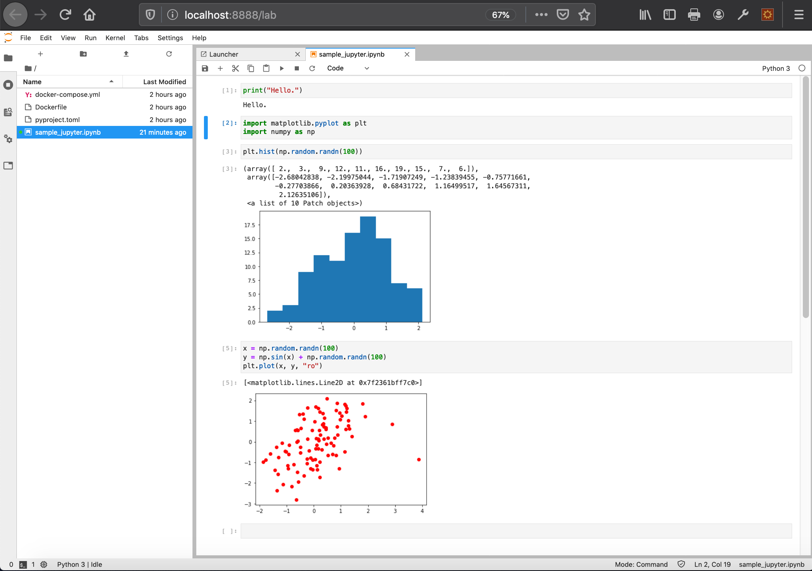
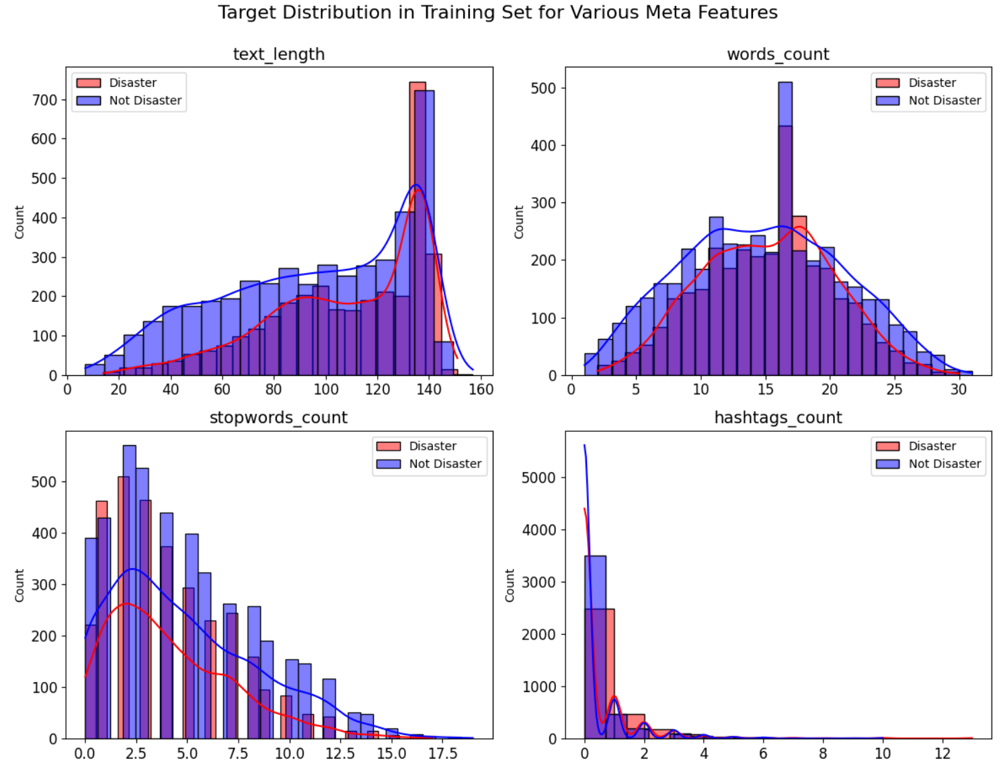

# JupyterLab in Poetry with Docker

Set up a **JupyterLab** runtime environment managed by **Poetry** within **Docker**.





---

## Version Information

- Python & Poetry

  ```
  ➜ docker compose run eda python --version
  Python 3.8.18

  ➜ docker compose run eda poetry --version
  Poetry (version 1.6.1)
  ```

- Included libraries

  Refer to **pyproject.toml** for details.

## Prerequisites

- Docker and Docker Compose installed.
- This repository is primarily intended for a __Mac__ environment (both M1 and Intel architectures).

## :star: Installation and Usage


- Clone the repository:
  ```sh
  git clone https://github.com/miolab/jupyterlab_poetry.git
  ```

- Build and start Docker containers:
  ```sh
  cd jupyterlab_poetry
  ```

  ```sh
  docker compose build
  ```

  ```sh
  docker compose up
  ```

- Open JupyterLab in your browser:
  - http://localhost:8890/lab

## :star: Adding & Updating Packages

### Add packages

```
docker compose run eda poetry add pyclustering
```

- When also specifying a version:

  ```
  docker compose run eda poetry add pyclustering@^0.10
  ```

### Preview Updates

```
docker compose run eda poetry update --dry-run
```

### Update packages

```
docker compose run eda poetry update
```

- After updating, rebuild and restart the containers:

  ```
  docker compose build
  docker compose up
  ```

- An example procedure is described here.

  - https://github.com/miolab/jupyterlab_poetry/issues/22

---

## Additional information

### Notes

- Poetry is used for package management purposes, and the virtual environment `venv` is avoided.

  `poetry config virtualenvs.create false`

### Uninstallation

To delete environment at once and erase directories, execute the following command.

```
docker compose down --rmi all --volumes
cd ../
rm -rf jupyterlab_poetry
```

### References

- Poetry

  - [Official](https://python-poetry.org/)

    - [The pyproject.toml file](https://python-poetry.org/docs/pyproject/)

  - [PyPI](https://pypi.org/project/poetry/)

  - [GitHub](https://github.com/python-poetry/poetry)

- Docker

  [Docker Official Images / Python](https://hub.docker.com/_/python)
